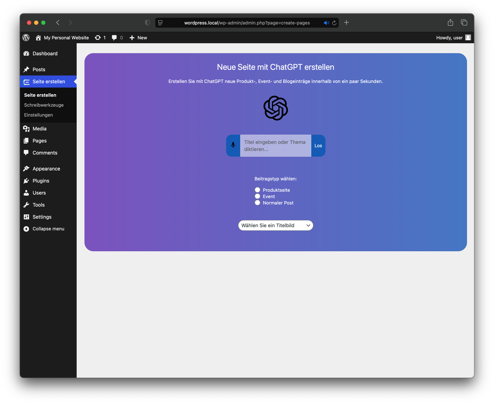

<h1>CMS Experts</h1>
<i>Published on: Friday, 01.17.2025 </i>
<i>Languages: HTML, CSS, PHP </i>
<i>Version: 1.0 </i>

CMS Experts is a fictional company, that was founded on the subject of a 'computer science project.'. In this subject, we had to choose a CMS of our choice and integrate ChatGPT into it for content generation.

We chose WordPress and developed a plugin:

## 1. Site-generation

The main feature of this plugin was the automatic site generation. In the Text field, you can enter the topic you want to generate a new site about. You can type it in or use your voice to dictate.

Next you can choose, what type of post you want to generate. You choose between:

- Product Page: a product page with different topics, separated by headings. A table of technical specifications is available if ChatGPT has explicit knowledge about it.
  
- Event: an event page with a quick info summary at the top and a rich information text below.
  
- Normal Post: a normal post seperated by headings.

## 2. Writing Tools

As the name suggests, the writing tools assist you in optimizing your text, before posting it on your WordPress site.

You have the following operations: summarize, proofread, bullet points (max. 5), friendly and professional.

## 3. Settings

Inside settings, you can save your API key to give the plugin access to use ChatGPT for its services.

Before the key will be saved, a quick connection test is performed, and the result will be returned to the user (see above).
Here the connection to the servers failed.

Here the connection to OpenAI was successful, and the result is being shown to the user. The key will be displayed in the case it'll get lost by human failure ;-)
